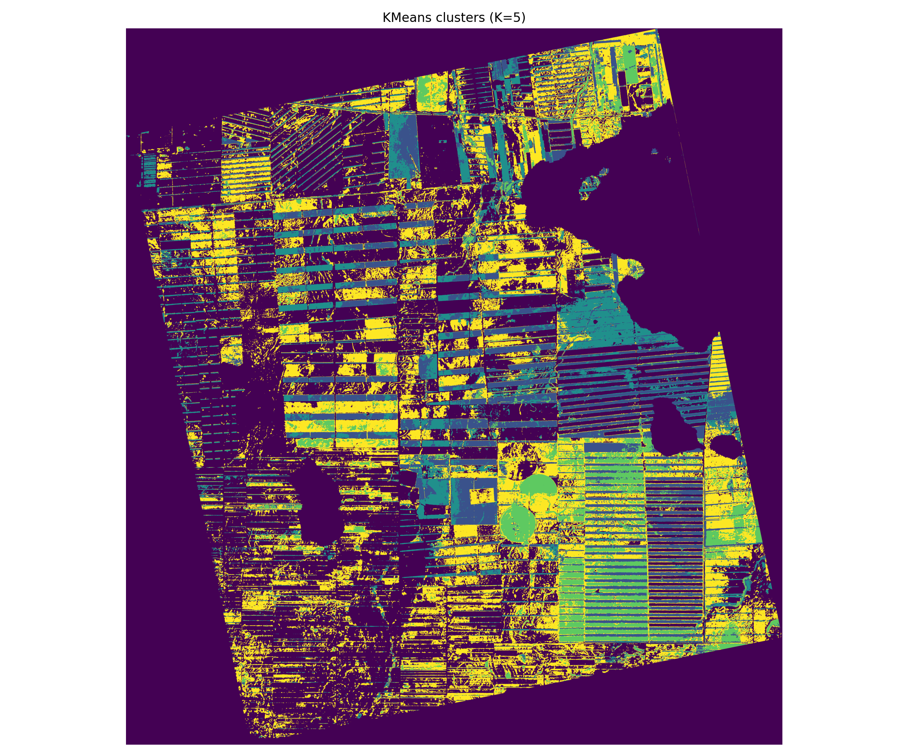
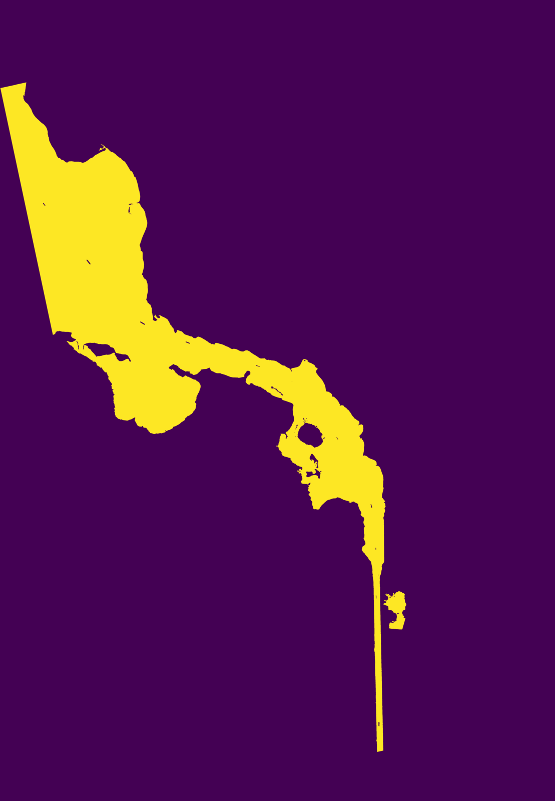

# wyvern-hsi-labs


Hyperspectral remote-sensing pipelines for [Wyvern](https://wyvern.space/) Dragonette open data: a small, tested Python library (`wyvernhsi`) plus two config-driven analysis projects built on it.

The library converts L1B top-of-atmosphere (TOA) radiance to TOA reflectance from STAC metadata, then provides reusable raster I/O, QA/water masking, spectral indices, and PCA + KMeans clustering. Each project is a thin orchestration layer driven by a YAML config and a single pipeline runner.

> **TOA, not surface.** No atmospheric correction is applied. All reflectance products are top-of-atmosphere; the spectral indices below are optical proxies, not validated geophysical quantities.

## Projects

| | [forest_landcover](projects/forest_landcover/) | [water_quality](projects/water_quality/) |
|---|---|---|
| **Study area** | Santa Cruz de la Sierra, Bolivia | Bitter Lake, Egypt |
| **Goal** | unsupervised land-cover grouping (PCA + KMeans) + SAM reference mapping | water masking + optical turbidity/chlorophyll proxies |
| **PC1 / 8-PC variance** | 77.5% / 99.0% | 74.2% / 95.9% |
| **K=5 silhouette / ARI** | 0.39 / 0.65 | 0.33 / 0.82 |

 

## Reproduce

```bash
pip install -e .
```

Raw scenes are not stored in git — see each project's `data/README.md` for how to fetch and place a scene. Then run a project's pipeline:

```bash
python pipelines/run_pipeline.py --config configs/forest_landcover.yaml
python pipelines/run_pipeline.py --config configs/water_quality.yaml
```

The runner loads the config, resolves the scene, runs the stages listed under `pipeline.stages`, and writes GeoTIFFs, figures, CSVs, a `manifest.json` (config + git SHA + package versions) and a `report.md` under the project's `outputs/`. All tunables (K, PCA components, band wavelengths, thresholds, ROIs, proxy weights) live in the YAML, not the code.

## Library layout

```
src/wyvernhsi/
  config.py        typed YAML config (fails fast on missing keys)
  paths.py         pure scene/path resolution (no import-time work)
  io.py            raster read/write + window tiling + composites
  radiometry.py    radiance -> TOA reflectance (pure numpy)
  stac.py          STAC metadata extraction (pystac)
  masks.py         QA clear-mask + water-mask loaders
  wavelengths.py   band-description parsing + nearest-wavelength selection
  indices.py       NDVI, NDTI, NDCI, red-edge slope, band ratio
  clustering.py    PCA+KMeans / standardized KMeans / tiled predict / ARI stability
  classification.py  Spectral Angle Mapper (SAM)
  visualization.py percentile stretch + RGB stretch + figure helpers
  reporting.py     run manifest + auto report
  logging_setup.py logging configuration
```

## Development

```bash
pip install -e ".[dev]"
ruff check src tests pipelines
pytest -q          # 34 tests
```

CI (GitHub Actions) installs the package and runs lint + tests on every push.

## Notes on interpretation

These are exploratory remote-sensing pipelines, and the READMEs are deliberate about what the numbers do and don't mean: KMeans groups are unsupervised (cluster IDs arbitrary), SAM has no accuracy assessment, water indices are optical proxies rather than concentrations, and with millions of pixels per group the meaningful statistic is effect size, not p-value. See each project README for the per-scene results and caveats.
