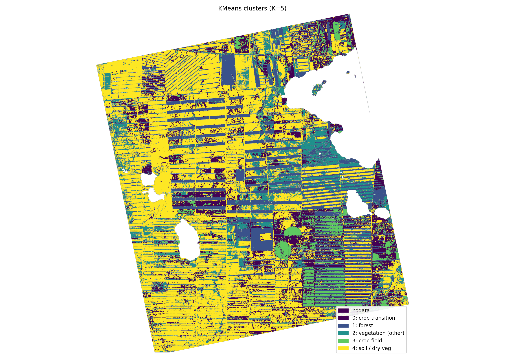
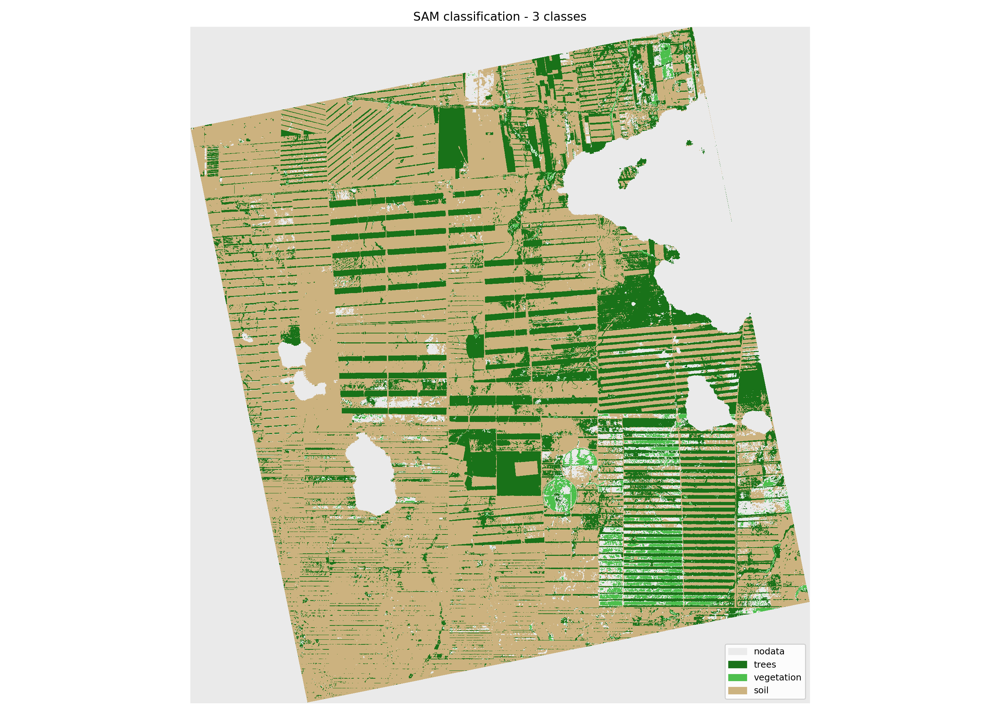
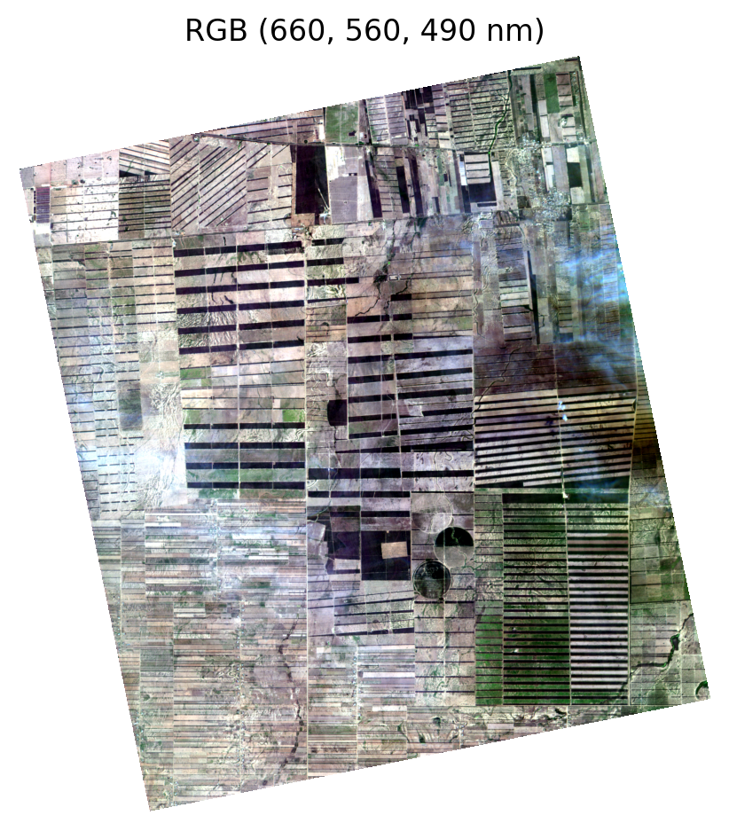
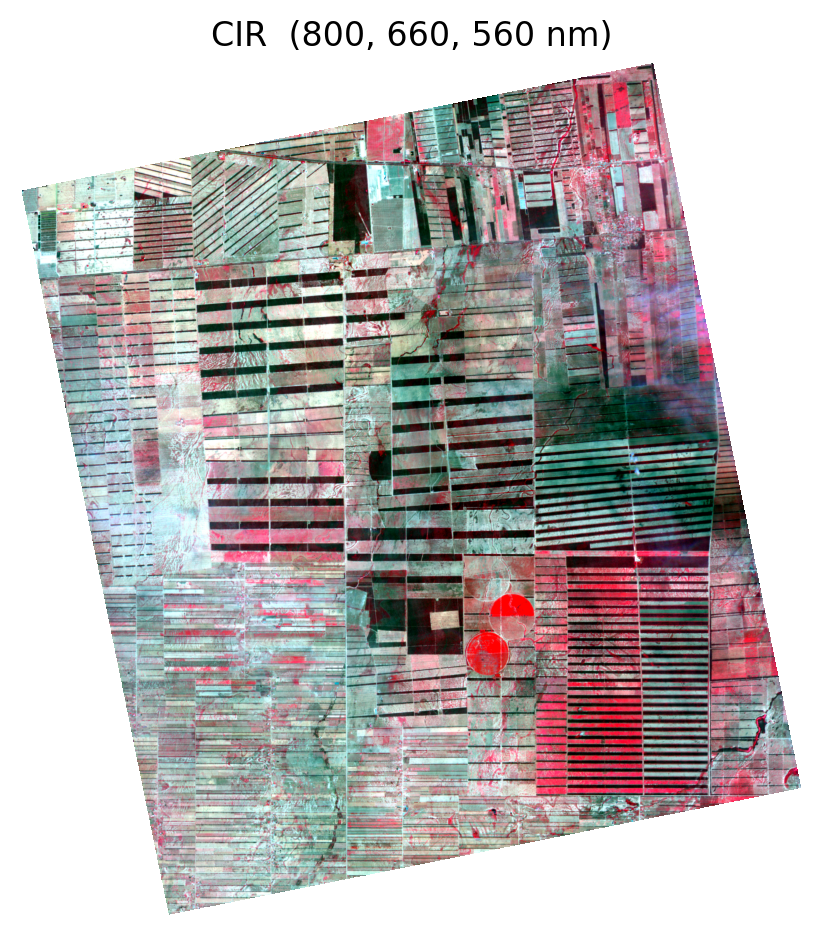
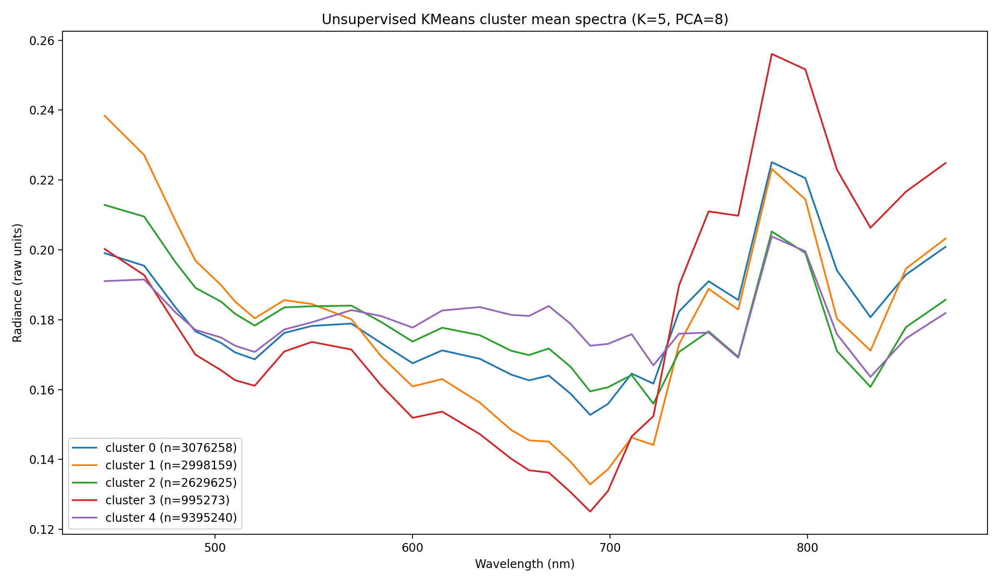
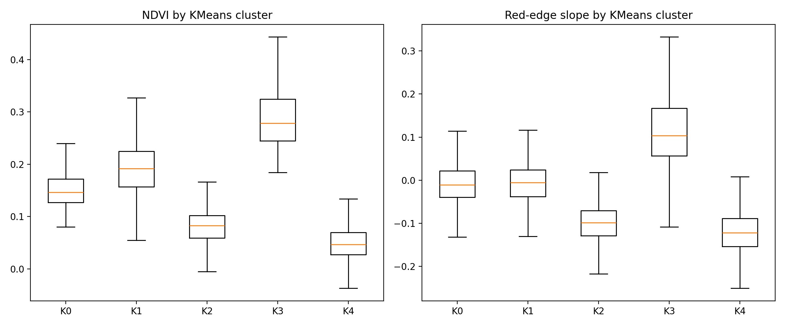

# Hyperspectral Land Cover Mapping with Wyvern Open Data

End-to-end hyperspectral image analysis pipeline using Wyvern Dragonette open data.  
Demonstrates unsupervised clustering, supervised spectral angle mapping (SAM), and spectral index validation on real satellite hyperspectral imagery.

### Key Highlights

- Unsupervised KMeans clustering (K=5) on normalized hyperspectral spectra  
- SAM classification using manually selected reference regions  
- Quantitative validation using NDVI and red-edge spectral indices  
- Fully reproducible Python pipeline  

---

### Example Outputs

**KMeans Clustering (K=5)**  


**SAM Classification**  


---

# Hyperspectral Land Cover Analysis with Wyvern Open Data

This project demonstrates an end-to-end hyperspectral image analysis workflow using Wyvern Dragonette open data. The pipeline combines unsupervised clustering, spectral angle mapping (SAM), and spectral index analysis to characterize agricultural and forested landscapes.

Study area: plantation-dominated region near Santa Cruz de la Sierra, Bolivia.

---

## Project Motivation

The goal of this project is to build a fully reproducible hyperspectral analysis workflow using open satellite data and standard Python tools.

Specifically, this project focuses on:

- Practical handling of hyperspectral image cubes  
- Shape-based spectral clustering and classification  
- Comparison of unsupervised and supervised methods  
- Quantitative validation using spectral indices  

The result is a compact but realistic example of how hyperspectral imagery can be used for land-cover analysis without relying on ground-truth labels.

---

## Data

**Source:** Wyvern Open Data Program  
**Product:** Dragonette hyperspectral L1B  
**Spectral range:** ~444–870 nm (31 bands)  
**Radiometric units:** Top-of-Atmosphere Radiance  

Wyvern QA cloud masks were applied to remove cloud-contaminated pixels.

---

## Processing Pipeline

### Conceptual Workflow

Wyvern Hyperspectral Image
|
v
Preprocessing & QA Masking
|
v
Spectral Normalization (L2)
|
+------------------------+
| |
v v
KMeans Clustering (PCA) SAM Classification
| |
v v
Cluster Spectra Analysis Class Maps
| |
+-----------+------------+
|
v
Spectral Index Analysis
(NDVI, Red-edge)
|
v
Result Validation

## Processing Overview

The workflow follows four main steps:

1. Preprocessing and normalization  
2. Unsupervised clustering (KMeans)  
3. Supervised classification (SAM)  
4. Spectral index validation  

---

## Raw Hyperspectral Visualization (Before Classification)

**RGB Composite (visible bands)**  


**False Color CIR Composite (NIR–Red–Green)**  


---
## Preprocessing

- Hyperspectral cube loaded using Rasterio  
- Band center wavelengths parsed from dataset metadata  
- Per-pixel L2 normalization applied to reduce illumination magnitude effects  
- Cloud pixels removed using Wyvern QA masks  

Normalization ensures clustering and similarity metrics are driven by spectral shape rather than brightness.

---

## Unsupervised Clustering (KMeans)

Unsupervised land cover structure was extracted using:

- PCA and KMeans were trained using a random subset of valid pixels to reduce computational load. The fitted models were then applied to the full scene to generate complete classification maps.
- PCA dimensionality reduction (8 components)  
- KMeans clustering (K = 5)  
- Clustering performed on normalized spectral vectors  

This step identifies dominant spectral patterns without prior labels.

### KMeans Cluster Map


### KMeans Cluster Spectra

Mean spectral signatures for each cluster:



The spectral curves show clear separation between vegetation-dominated clusters, transitional crop areas, and soil-dominated surfaces.

---

## Supervised Classification (SAM)

Spectral Angle Mapping (SAM) was applied using manually selected reference regions representing:

- Dense tree canopy  
- High-biomass vegetation  
- Soil / low vegetation  

SAM provides interpretable land-cover classes using spectral similarity.

### SAM Classification Map


---

## Spectral Index Analysis

Two vegetation-sensitive indices were computed to validate class separability:

NDVI = (NIR − Red) / (NIR + Red)
Red-Edge = (RE720 − R660) / (720 − 660)


### Index Distributions (KMeans)



---

## Quantitative Summary

Mean values per class:

| Source | Class | NDVI Mean | Red-edge Slope |
|--------|--------|------------|----------------|
| KMeans | Cluster 3 (high biomass crops) | 0.295 | +0.113 |
| KMeans | Cluster 1 (forest) | 0.191 | -0.008 |
| KMeans | Cluster 4 (soil / dry surface) | 0.048 | -0.121 |
| SAM | Vegetation | 0.345 | +0.157 |
| SAM | Trees | 0.167 | -0.027 |
| SAM | Soil | 0.063 | -0.106 |

Vegetation classes consistently exhibit higher NDVI and positive red-edge slope values, while soil-dominated surfaces show low NDVI and strongly negative slopes.

Agreement across unsupervised clustering, supervised classification, and spectral indices provides confidence in the extracted land-cover patterns.
---
## PCA Dimensionality Analysis

Principal Component Analysis (PCA) was used to reduce spectral dimensionality prior to clustering.

### Explained Variance

- PC1: 66.3%  
- PC2: 23.7%  
- PC3: 8.6%  

The first three components explain over 98% of total spectral variance.

This indicates that most spectral structure in the scene can be represented using a small number of orthogonal components, which justifies PCA-based dimensionality reduction for clustering.

### PCA Composite Visualization

A PC1/PC2/PC3 RGB composite highlights dominant spectral patterns across the scene.


---
## Clustering Quality Metrics

Several standard data science metrics were used to evaluate clustering performance.

### Silhouette Score

Average silhouette score (sampled): **0.383**

This indicates moderate-to-strong cluster separation given the complexity of natural land cover spectra and the absence of labeled training data.

### Stability Analysis (Adjusted Rand Index)

KMeans was repeated using multiple random initializations.

Mean Adjusted Rand Index (ARI) across runs:

**0.983**

This demonstrates very high clustering stability and indicates that the resulting land-cover structure is robust to random initialization.

### PCA Variance Summary

Using 8 PCA components preserves over **99.6%** of total spectral variance while significantly reducing dimensionality.

This enables efficient clustering while maintaining spectral fidelity.

---

## Discussion

The results demonstrate consistent structure across unsupervised clustering, supervised SAM classification, and spectral index analysis.

KMeans clustering identified multiple vegetation and soil-related spectral groups that align with visible agricultural patterns and plantation structure. The separation between high-biomass vegetation, forest canopy, transitional crops, and soil surfaces is supported by both NDVI and red-edge slope statistics.

SAM classification produced more conservative vegetation and tree classes, as expected from a reference-based spectral similarity method. While SAM captured strong vegetation signals reliably, it underrepresented mixed or transitional surfaces compared to the unsupervised approach.

PCA analysis shows that more than 98% of spectral variance is captured by the first three components, indicating strong spectral redundancy in the scene. This supports the use of PCA for dimensionality reduction prior to clustering.

Clustering stability analysis further indicates that the extracted land-cover structure is robust. An Adjusted Rand Index above 0.98 across multiple runs demonstrates that the clustering solution is not sensitive to initialization and reflects consistent spectral patterns.

Overall, the agreement between multiple independent methods suggests that the derived land-cover classes represent physically meaningful surface types rather than algorithm artifacts.


---

## Running the Pipeline

### Environment Setup

Create a virtual environment and install dependencies:

```bash
python -m venv .venv
source .venv/bin/activate   # Linux / Mac
.venv\Scripts\activate      # Windows

pip install -r requirements.txt

---

### Core Processing Steps

Run scripts in this order:

1) SAM
    python scripts/12_sam_fullscene_geotiff.py

2) Unsupervised clustering

    python scripts/15_unsupervised_kmeans.py

3) Export KMeans visualizations

    python scripts/22_export_kmeans_previews.py

4) SAM classification visualization

    python scripts/23_export_sam_previews.py

5) Spectral index analysis

    python scripts/24_compute_indices.py

6) Analysis 

    python scripts/25_analsysis_metrics.py

All outputs are written to the `outputs/` directory.
```

---

## Limitations

- Atmospheric correction was not applied (TOA radiance used).
- VNIR-only spectral range limits mineral and moisture analysis.
- No external spectral library matching was performed due to bandpass incompatibility.

---

## Dependencies

- rasterio
- numpy
- scipy
- scikit-learn
- matplotlib
- scikit-image

---

## License

This project uses Wyvern Open Data and open-source Python scientific libraries.
