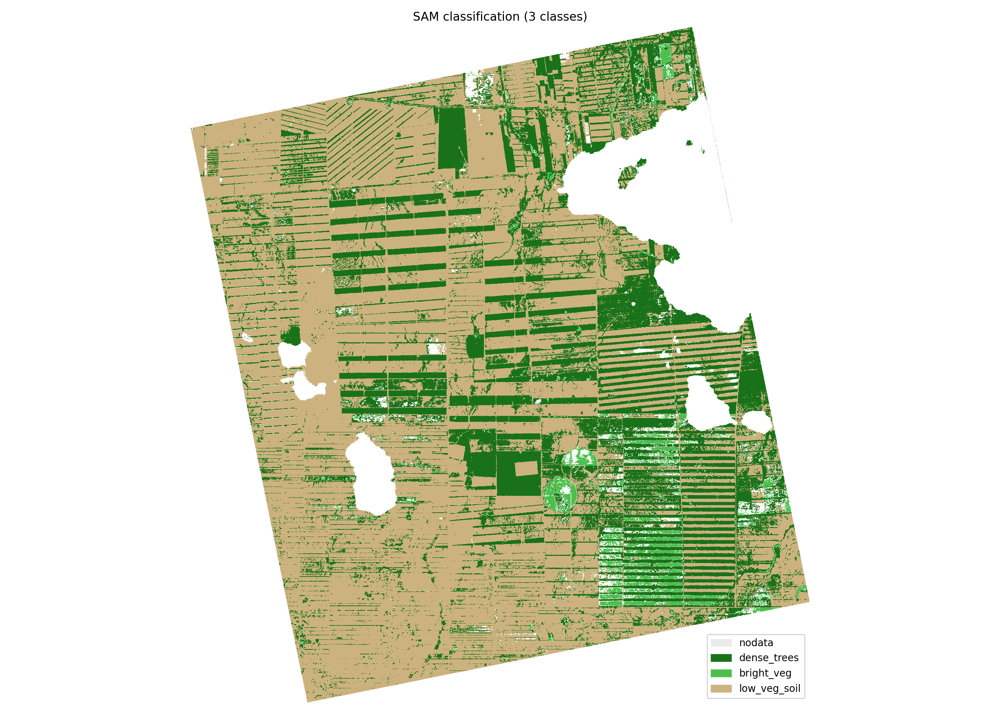
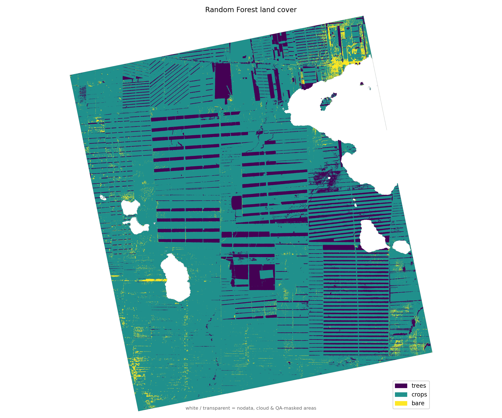
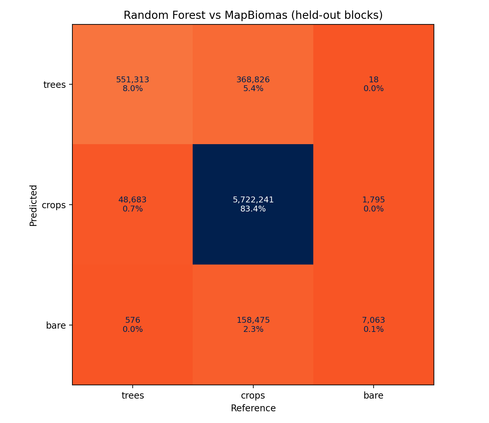

# Hyperspectral Land Cover Mapping — Wyvern Dragonette

Unsupervised vegetation-cover grouping, reference-spectrum mapping, and independent validation over a 31-band VNIR hyperspectral scene from the [Wyvern](https://wyvern.space/) Dragonette constellation, processed from L1B TOA radiance to top-of-atmosphere (TOA) reflectance.

**Study area:** Santa Cruz de la Sierra region, Bolivia (agricultural frontier). **Sensor:** Wyvern Dragonette, 31 VNIR bands (444–870 nm). **Processing:** TOA reflectance, no atmospheric correction.

## What this project maps

The scene is a crop-dominated agricultural frontier: forest patches set in a matrix of soybean, other crops, and farming, with some bare or harvested ground and a little urban. The pipeline characterises it along the one axis that single-date VNIR hyperspectral data can actually resolve, a vegetation-density gradient running from dense forest canopy down to bare soil. It does not try to tell crop *types* apart (soybean versus other crop). That is a land-use distinction, and separating it reliably needs multi-temporal data rather than a single date's spectra.

## The scene

**Colour-infrared quicklook (full scene).** Vegetation reflects strongly in the near-infrared and renders red, while bare and built surfaces stay muted.


## Method

```text
L1B TOA radiance
   │  convert  ── STAC solar illumination, sun elevation, Earth–Sun distance
   ▼
TOA reflectance ──► QA clear-mask
   │
   ├─► unsupervised grouping   PCA(8) + KMeans(K=5), L2-normalised, tiled prediction
   ├─► reference-spectrum map   SAM vs hand-picked reference ROIs (3 cover types)
   ├─► supervised classifier    Random Forest on bands+indices, spatial-block split
   ├─► index separability       NDVI, red-edge slope per group (effect sizes)
   └─► validation               vs MapBiomas Bolivia Collection 3 (independent reference)
```

Stated up front: KMeans is unsupervised, so cluster IDs are arbitrary; SAM is reference-spectrum matching with no built-in accuracy assessment; and validation reports agreement with an independent map, not absolute accuracy.

## Results

### Spectral dimensionality

**PCA composite (PC1, PC2, PC3 → R, G, B).** The 31 bands collapse onto a handful of axes. PC1 alone explains **77.5%** of variance, the first two PCs **96.1%**, and eight PCs **99.0%**.


### KMeans clusters

K=5, sampled silhouette **0.39**, 6-seed mean ARI **0.65**. Ordered by median NDVI:

| Cluster | Median NDVI | Scene fraction | Reading |
|---|---|---|---|
| 0 | 0.19 | 30.6% | least-vegetated / bare |
| 2 | 0.26 | 6.2% | sparse vegetation |
| 4 | 0.27 | 16.6% | sparse–moderate vegetation |
| 1 | 0.35 | 7.6% | moderate vegetation |
| 3 | 0.40 | 3.9% | densest / closed-canopy |


*White (transparent) areas are nodata plus cloud and QA-masked pixels excluded from clustering, not a cluster class.*

**Cluster mean spectra.** The curves fan out by the height of the NIR plateau and the steepness of the red-edge rise (~700–740 nm), which are what drive the NDVI gradient in the table above.


### Separability

With one to nine million pixels per cluster, every pairwise t-test returns p ≈ 0, so effect size is the meaningful quantity (`index_separability_tests_K5.csv`). By Cohen's d on NDVI the extremes are strongly separable (cluster 0 vs 1, d ≈ −6.2; 0 vs 3, d ≈ −4.9), while clusters 2 and 4 are nearly identical (d ≈ −0.40).

## Validation against MapBiomas Bolivia 2024

An independent regional land-cover product (MapBiomas Bolivia Collection 3, 2024 layer, 30 m) was reprojected onto the scene grid by nearest-neighbour and collapsed to the classes present here: trees, crops, and bare. Grass and water are effectively absent in this window (0 and ~860 reference pixels) and are excluded. The numbers below are agreement with MapBiomas, itself a model with its own error, not absolute accuracy.

> **Read kappa, not overall agreement.** The scene is roughly 88% cropland, so overall agreement is inflated by the majority class (a trivial "everything is crops" map already scores about 0.88). Cohen's kappa corrects for that chance agreement and is the honest summary.

### KMeans (clusters labeled by majority overlap)

Overall agreement **0.92**, **kappa 0.59 (moderate)**.


| class | precision | recall | reference support |
|---|---|---|---|
| trees | 0.65 | 0.64 | 2,265,024 |
| crops | 0.95 | 0.95 | 16,810,188 |
| bare  | n/a  | 0.00 | 18,474 |

One cluster cleanly isolates tree cover (around 0.65 precision and recall), while the other four all map to cropland. On a single VNIR date the agricultural matrix is one broad spectral smear that the greenness gradient slices into density tiers rather than crop types, and MapBiomas labels all of it as farming regardless. Bare is real but tiny (0.1%) and has no dedicated cluster.

**The main disagreement is informative, not erroneous.** Where this map says bare or sparse and MapBiomas says crops, both can be right. MapBiomas reports annual land use (a harvested soybean field stays "soybean" all year), whereas single-date reflectance reports instantaneous land cover (that same field is bare soil on the acquisition date). Part of the bare-versus-crops difference is this land-cover versus land-use distinction, and in those spots the snapshot is arguably closer to the actual surface than the annual label.

### SAM (3 reference ROIs)

Overall agreement **0.14**, **kappa 0.08 (negligible)**, and the matrix shows why.



*SAM's three reference-spectrum classes (dense_trees, bright_veg, low_veg_soil) are its own spectral endmembers, mapped to trees, crops, and bare only at validation time.*


SAM catches nearly all tree cover (recall 0.97) but is right only **37% of the time it says "trees"** (precision 0.37), because it floods the trees class with cropland. More damning still, it recovers just **2.4% of cropland** (crops recall 0.024). Its three ROIs were trees, bright vegetation, and soil, so the dominant bare and harvested cropland matches the soil endmember instead, dumping 12.2 million crop pixels into "bare." SAM is not malfunctioning. It is a fixed three-endmember method applied to a scene whose dominant class, cropland, it was never given an endmember for, so it cannot align with the reference. That is the structural limit of reference-spectrum mapping with a hand-picked ROI set.

### Random Forest (supervised, MapBiomas labels, spatial-block split)

Held-out overall agreement **0.92**, **kappa 0.62**.

A Random Forest (200 trees) was trained on per-pixel features (all 31 reflectance bands plus NDVI and red-edge slope), with labels sampled from the crosswalked MapBiomas classes (balanced, capped per class). Train and test were split by spatial blocks (an 8×8 grid, whole blocks held out) rather than by random pixels. This matters mainly because: adjacent pixels are near-identical, so a random split leaks neighbours into the test set and inflates accuracy. All numbers below are on held-out spatial blocks, which is the honest generalization, and they measure how well the spectra reproduce MapBiomas labels, not ground truth.





| class | precision | recall | reference support (test) |
|---|---|---|---|
| trees | 0.60 | 0.92 | 600,572 |
| crops | 0.99 | 0.92 | 6,249,542 |
| bare  | 0.04 | 0.80 | 8,876 |

RF finds nearly all tree cover (recall 0.92) but over-predicts it, since 40% of its "trees" are MapBiomas crops along the fuzzy forest-field edge. Crops, the 88% majority, come out near-perfect (precision 0.99). **Bare's precision is 0.04**: of the pixels RF calls bare, almost all are MapBiomas crops. As with KMeans, this is largely the land-cover versus land-use distinction, where RF finds genuinely bare or harvested ground that MapBiomas labels "crops" by annual use. With only about 8,900 bare test pixels, that class is low-support and should be read with caution.

**Feature importance shows RF rediscovering the spectral physics.** The most important features cluster tightly in the red-edge (722, 711, 735, 750, 765 nm) and green (615, 569, 549, 584 nm) regions, while the blue bands (444–520 nm) rank dead last. Blue is exactly the region most corrupted by atmospheric scattering on TOA data and the least informative for vegetation. The raw red-edge bands also outrank the engineered indices: `re_slope` comes 14th and `ndvi` 22nd, both below the individual bands they summarize. The classifier extracted its discriminating signal directly from the spectrum rather than leaning on pre-defined indices, a concrete illustration of why hyperspectral bands can outperform index-based methods, and an independent confirmation of the red-edge framing this project assumed from the start.

### What the validation says about the methods

Across all three methods the same ceiling appears. Unsupervised KMeans (kappa 0.59) recovers a real vegetation-density gradient with clean tree separation. SAM (kappa 0.08), lacking a cropland endmember, collapses on a crop-dominated scene, a structural limit of fixed-ROI reference matching. Supervised Random Forest (kappa 0.62), trained directly on the labels, beats unsupervised clustering by only 0.03 kappa. That near-tie is the central finding: when a properly trained supervised classifier barely outperforms blind clustering, the limiting factor is the data, not the method. Single-date VNIR fundamentally cannot separate these agricultural classes much better than the greenness gradient already does. The methods differ in how they fail and in what they reveal (RF additionally confirms the red-edge as the discriminating region), but none of them breaks the single-date ceiling. Multi-temporal data, capturing crop phenology across the season, is what operational products like MapBiomas use to cross it.

## Reproduce

```bash
pip install -e .
python pipelines/run_pipeline.py --config configs/forest_landcover.yaml
# validation runs when a reference tif is present, and is skipped otherwise:
python projects/forest_landcover/scripts/validate_landcover.py
```

Stages and parameters live in `configs/forest_landcover.yaml`, and the validation crosswalk (MapBiomas code to class) is config-driven there.

## Limitations and next steps

Single-date VNIR resolves vegetation density, not crop type. The agricultural matrix is spectrally inseparable here, and that ceiling is set by the data, not the method. Validation is concordance with MapBiomas (an independent model with its own accuracy, reported on the project's Accuracy page), not ground truth. The supervised Random Forest stage, trained on MapBiomas labels with a spatial-block split, confirms that this is a data ceiling rather than a method gap.

**On the SAM endmembers.** SAM's failure here is partly fixable and partly not. The fixable part is that its three ROIs (trees, bright vegetation, soil) included no cropland endmember, so cropland had nowhere to go and flooded into the soil class; adding a cropland ROI and choosing purer endmembers would raise its agreement. The part that better endmembers cannot fix is more fundamental: cropland is a land-*use* category, not a single spectral material. An active crop field carries a full vegetation signature (red-edge jump, NIR plateau), while a harvested or fallow field is bare soil with a completely different, flat soil spectrum. The two are not similar patterns to a spectral classifier; they are different materials. No single "cropland" endmember can represent both states, because the class is defined by use across the season rather than by spectrum on one day.

**On the promise of hyperspectral.** The premise that more bands should separate crops is true in principle, but with two qualifiers this dataset hits squarely. First, the spectral features that most distinguish crop types (leaf water, cellulose, lignin, nitrogen) sit largely in the short-wave infrared (1000–2500 nm), which Dragonette does not cover. Its bands are all in the VNIR, the region where green crops look broadly alike, so this is more bands than a multispectral sensor but concentrated where crops are most similar, not where they most differ. Second, even a SWIR-equipped sensor struggles to separate crop types from a single image, because the strongest discriminator between crops is not their spectrum on any one day but how that spectrum changes through the season. Hyperspectral adds spectral depth; it does not substitute for the temporal axis. The Random Forest result makes this concrete: even with all 31 bands available, a supervised classifier could not separate the crop classes, because the information needed to tell them apart simply is not present in a single VNIR scene.

The natural next step for crop-type separation is multi-temporal acquisition (phenology across the growing season), ideally paired with a SWIR-capable sensor, neither of which single-date VNIR can substitute for.

## Data sources & attribution

**Validation reference — MapBiomas Bolivia, Collection 3** (Landsat-derived land cover & use, 30 m), used following the project's required citation format:

> MapBiomas – Collection [3] of the [Annual] Series of [Land Cover and Use] Maps of Bolivia, accessed on [26 June 2026] through the link: [[https://bolivia.mapbiomas.org/en/colecciones-mapbiomas-bolivia/](https://bolivia.mapbiomas.org/en/colecciones-mapbiomas-bolivia/)]

Fill the bracketed fields with the collection/series of the layer you downloaded and your access date. References:
- Downloads: https://bolivia.mapbiomas.org/en/descargas/
- Legend codes (source of the crosswalk used here): https://bolivia.mapbiomas.org/en/codigos-de-la-leyenda/
- Terms of use: https://bolivia.mapbiomas.org/en/terminos-de-uso/
- Accuracy: https://bolivia.mapbiomas.org/en/exactitud/

**Imagery — Wyvern Dragonette** open hyperspectral data, licensed under [CC BY 4.0](https://creativecommons.org/licenses/by/4.0/):

> © 2025 Wyvern Incorporated. All Rights Reserved.

MapBiomas is provided by the SEEG/OC initiative, powered by Google Earth Engine.

