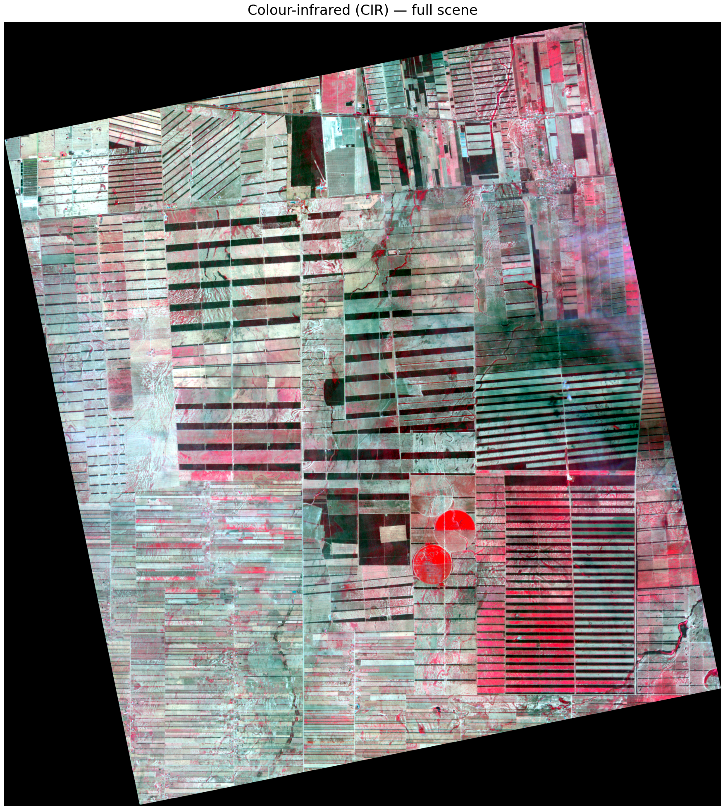
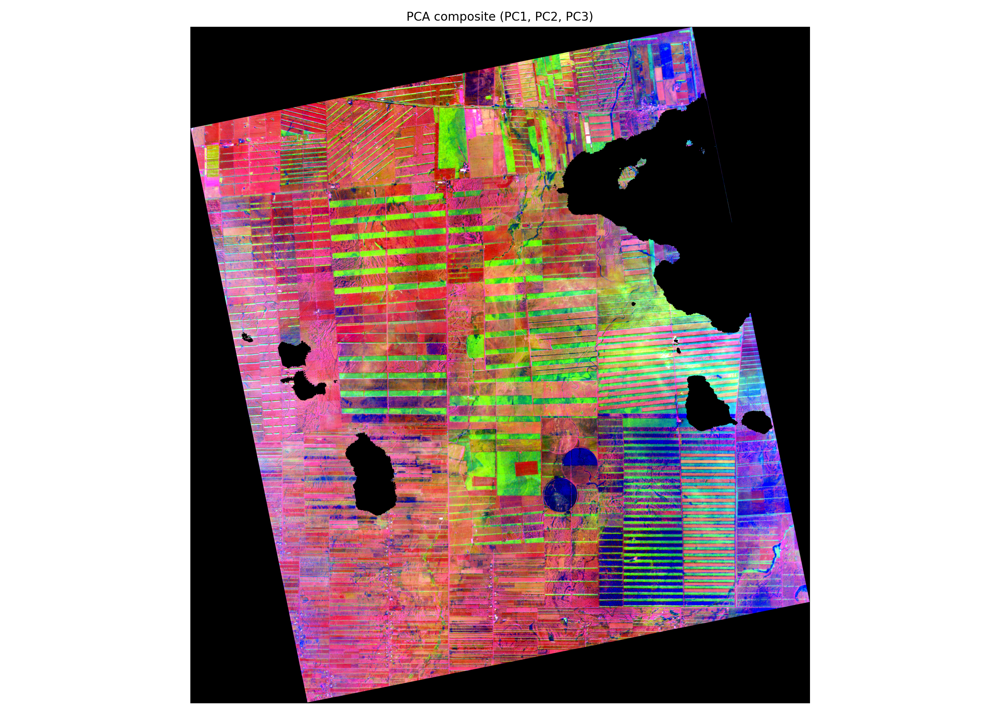
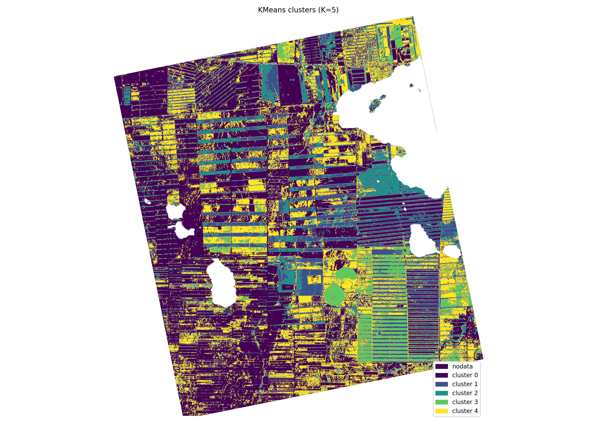
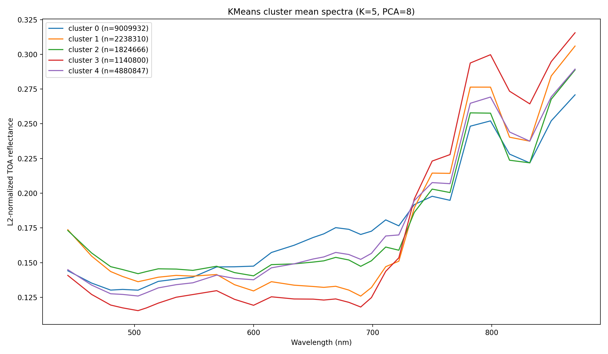
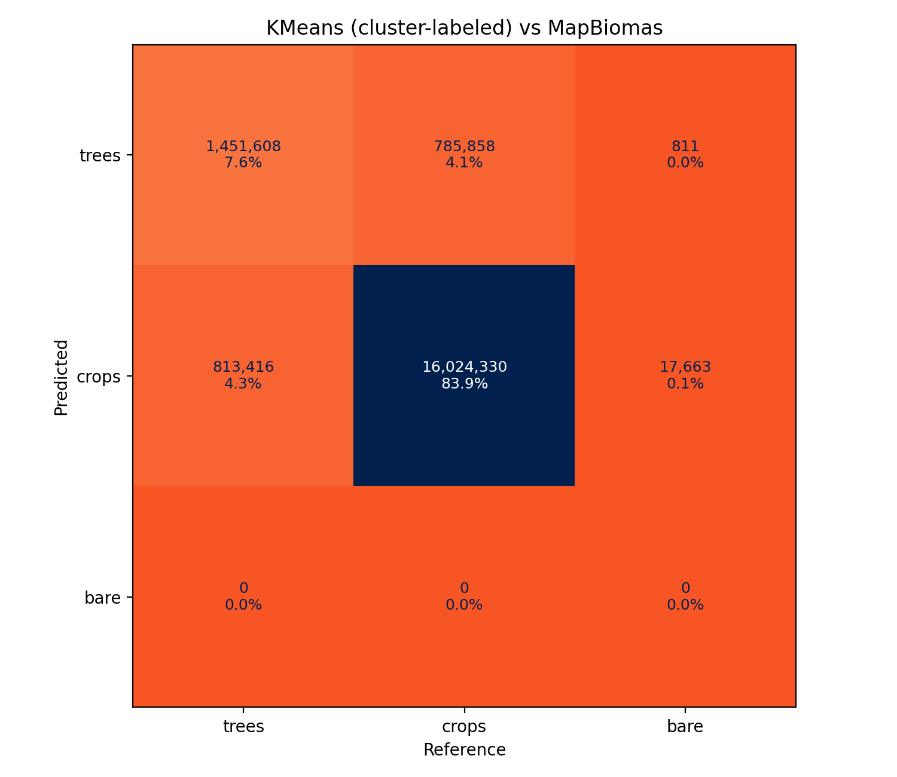
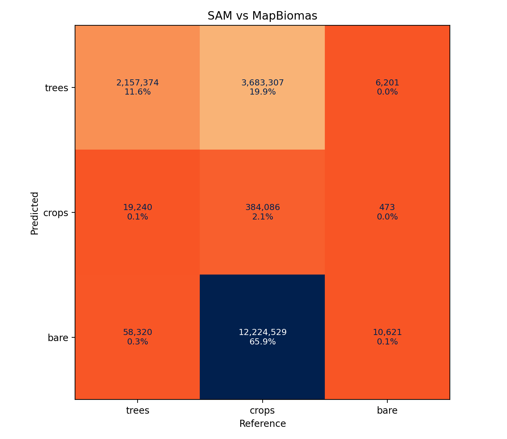

# Hyperspectral Land Cover Mapping — Wyvern Dragonette

Unsupervised vegetation-cover grouping, reference-spectrum mapping, and independent validation over a 31-band VNIR hyperspectral scene from the [Wyvern](https://wyvern.space/) Dragonette constellation, processed from L1B TOA radiance to **top-of-atmosphere (TOA) reflectance**.

**Study area:** Santa Cruz de la Sierra region, Bolivia (agricultural frontier). **Sensor:** Wyvern Dragonette, 31 VNIR bands (~510–900 nm). **Processing:** TOA reflectance, no atmospheric correction.

## What this maps

The scene is a crop-dominated agricultural frontier — forest patches in a matrix of soybean, other crops, and farming, with some bare/harvested ground and urban. The pipeline characterises it along the axis hyperspectral VNIR can actually resolve on a single date: a **vegetation-density / bareness gradient**, from dense forest canopy to bare soil. It does **not** attempt to discriminate crop *types* (soybean vs other crop) — that is a land-*use* distinction requiring multi-temporal data, not single-date spectra.

## The scene

**Colour-infrared quicklook (full scene).** Vegetation reflects strongly in the near-infrared and renders red; bare and built surfaces stay muted.



## Method

```text
L1B TOA radiance
   │  convert  ── STAC solar illumination, sun elevation, Earth–Sun distance
   ▼
TOA reflectance ──► QA clear-mask
   │
   ├─► unsupervised grouping   PCA(8) + KMeans(K=5), L2-normalised, tiled prediction
   ├─► reference-spectrum map   SAM vs hand-picked reference ROIs (3 cover types)
   ├─► index separability       NDVI, red-edge slope per group (effect sizes)
   └─► validation               vs MapBiomas Bolivia 2024 (independent reference)
```

Stated up front: KMeans is unsupervised (cluster IDs arbitrary); SAM is reference-spectrum matching with no accuracy assessment; validation reports **agreement** with an independent map, not absolute accuracy.

## Results (reference run)

### Spectral dimensionality

**PCA composite (PC1, PC2, PC3 → R, G, B).** The 31 bands collapse onto few axes — PC1 explains **77.5%** of variance, two PCs **96.1%**, eight PCs **99.0%**.



### KMeans clusters

K=5, sampled silhouette **0.39**, 6-seed mean ARI **0.65**. Ordered by median NDVI:

| Cluster | Median NDVI | Scene fraction | Reading |
|---|---|---|---|
| 0 | 0.19 | 30.6% | least-vegetated / bare |
| 2 | 0.26 | 6.2% | sparse vegetation |
| 4 | 0.27 | 16.6% | sparse–moderate vegetation |
| 1 | 0.35 | 7.6% | moderate vegetation |
| 3 | 0.40 | 3.9% | densest / closed-canopy |



*White (transparent) areas are nodata plus cloud/QA-masked pixels excluded from clustering — not a cluster class.*

**Cluster mean spectra** — curves fan out by the height of the NIR plateau and the steepness of the red-edge rise (~700–740 nm), the drivers of the NDVI gradient above.



### Separability

With 1–9M pixels per cluster, all pairwise t-tests give p ≈ 0, so effect size is the meaningful quantity (`index_separability_tests_K5.csv`). By Cohen's d on NDVI the extremes are strongly separable (cluster 0 vs 1, d ≈ −6.2; 0 vs 3, d ≈ −4.9); clusters 2 and 4 are nearly identical (d ≈ −0.40).

## Validation against MapBiomas Bolivia 2024

An independent regional land-cover product (MapBiomas Bolivia Collection 3, 2024 layer, 30 m) was reprojected onto the scene grid (nearest-neighbour) and collapsed to the classes present here — **trees, crops, bare**. Grass and water are effectively absent in this window (0 and ~860 reference pixels) and are excluded. Reported numbers are **agreement with MapBiomas** — itself a model with its own error — not absolute accuracy.

> **Read kappa, not overall agreement.** The scene is ~88% cropland, so overall agreement is inflated by the majority class (a trivial "everything is crops" map scores ~0.88). Cohen's kappa corrects for chance agreement and is the honest summary.

### KMeans (clusters labeled by majority overlap)

Overall agreement **0.92** · **kappa 0.59 (moderate)**



| class | precision | recall | reference support |
|---|---|---|---|
| trees | 0.65 | 0.64 | 2,265,024 |
| crops | 0.95 | 0.95 | 16,810,188 |
| bare  | n/a  | 0.00 | 18,474 |

One cluster cleanly isolates tree cover (~0.65 precision/recall); the other four all map to cropland. On a single VNIR date the agricultural matrix is one broad spectral smear that the greenness gradient slices into density tiers, not crop types — and MapBiomas labels it all as farming regardless. Bare is real but tiny (0.1%) with no dedicated cluster.

**The key disagreement is informative, not error.** Where this map says bare/sparse and MapBiomas says crops, both can be right: MapBiomas reports annual **land use** (a harvested soybean field stays "soybean" year-round), while single-date reflectance reports instantaneous **land cover** (that field is bare soil on the acquisition date). Part of the bare↔crops difference is this land-cover/land-use distinction, where the snapshot is arguably closer to the actual surface than the annual label.

### SAM (3 reference ROIs)

Overall agreement **0.14** · **kappa 0.08 (negligible)** — and the matrix shows why.



SAM finds tree cover well (recall ~0.97) but has **no functioning cropland class**: its three ROIs were trees / bright-vegetation / soil, so cropland splits two ways — a small lush fraction matches "bright vegetation," and the dominant bare/harvested fraction matches the soil endmember, flooding "bare" with 12.2M cropland pixels. SAM isn't malfunctioning — it is a fixed 3-endmember method applied to a scene whose dominant class (cropland) it was never given, so it cannot align with the reference. That is the structural limit of reference-spectrum mapping with a hand-picked ROI set.

### What the validation says about the methods

Unsupervised KMeans recovers a real vegetation-density gradient (clean tree separation, moderate kappa) but cannot respect land-use categories it was never shown. SAM, lacking a cropland endmember, collapses on a crop-dominated scene. Both point to the same next step: a **supervised** classifier trained on labeled examples — the one approach that learns the target classes directly — as the honest test of whether single-date VNIR carries enough signal to recover land-use labels, or whether it fundamentally cannot.

## Reproduce

```bash
pip install -e .
python pipelines/run_pipeline.py --config configs/forest_landcover.yaml
# validation runs when a reference tif is present (skipped otherwise):
python projects/forest_landcover/scripts/validate_landcover.py
```

Stages and parameters live in `configs/forest_landcover.yaml`; the validation crosswalk (MapBiomas code → class) is config-driven there.

## Limitations & next steps

Single-date VNIR resolves vegetation density, not crop type — the agricultural matrix is spectrally inseparable here, and that ceiling is the data, not the method. Validation is concordance with MapBiomas (an independent model with its own accuracy, reported on the project's Accuracy page), not ground truth. Next step: a supervised Random Forest trained on MapBiomas-sampled labels with a disjoint train/test split, to test whether the spectra can recover land-use labels the unsupervised gradient cannot.

## Data sources & attribution

**Validation reference — MapBiomas Bolivia, Collection 3** (Landsat-derived land cover & use, 30 m), used following the project's required citation format:

> MapBiomas – Collection [3] of the [Annual] Series of [Land Cover and Use] Maps of Bolivia, accessed on [26 June 2026] through the link: [[https://bolivia.mapbiomas.org/en/colecciones-mapbiomas-bolivia/](https://bolivia.mapbiomas.org/en/colecciones-mapbiomas-bolivia/)]

Fill the bracketed fields with the collection/series of the layer you downloaded and your access date. References:
- Downloads: https://bolivia.mapbiomas.org/en/descargas/
- Legend codes (source of the crosswalk used here): https://bolivia.mapbiomas.org/en/codigos-de-la-leyenda/
- Terms of use: https://bolivia.mapbiomas.org/en/terminos-de-uso/
- Accuracy: https://bolivia.mapbiomas.org/en/exactitud/

**Imagery — Wyvern Dragonette** open hyperspectral data, licensed under [CC BY 4.0](https://creativecommons.org/licenses/by/4.0/):

> © 2025 Wyvern Incorporated. All Rights Reserved.

MapBiomas is provided by the SEEG/OC initiative, powered by Google Earth Engine.
