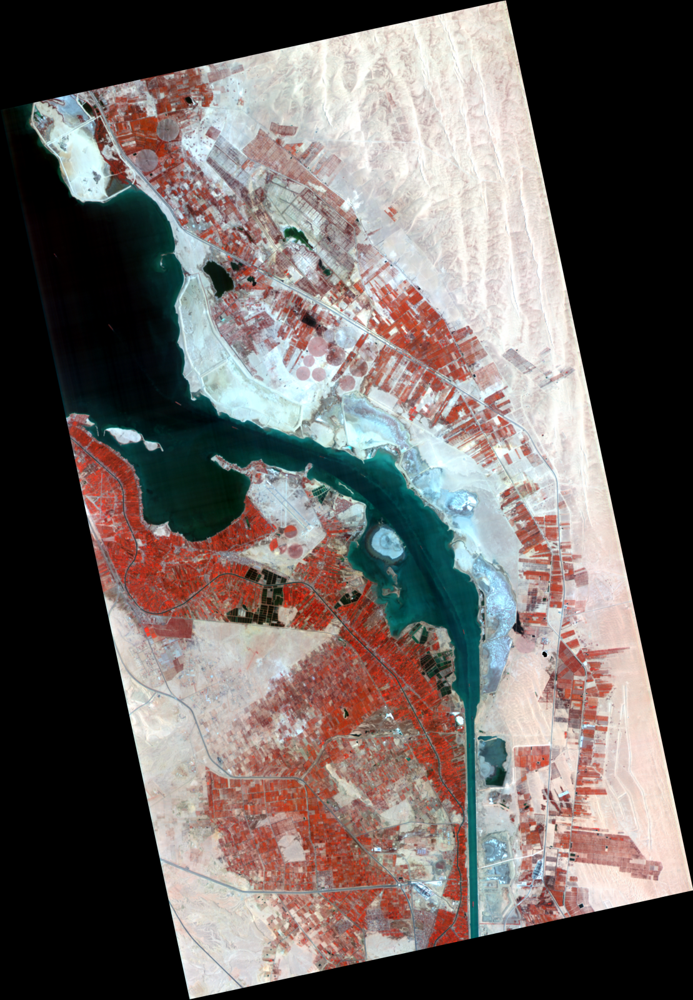
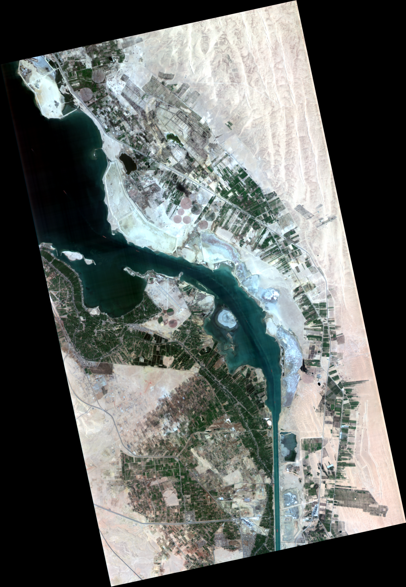
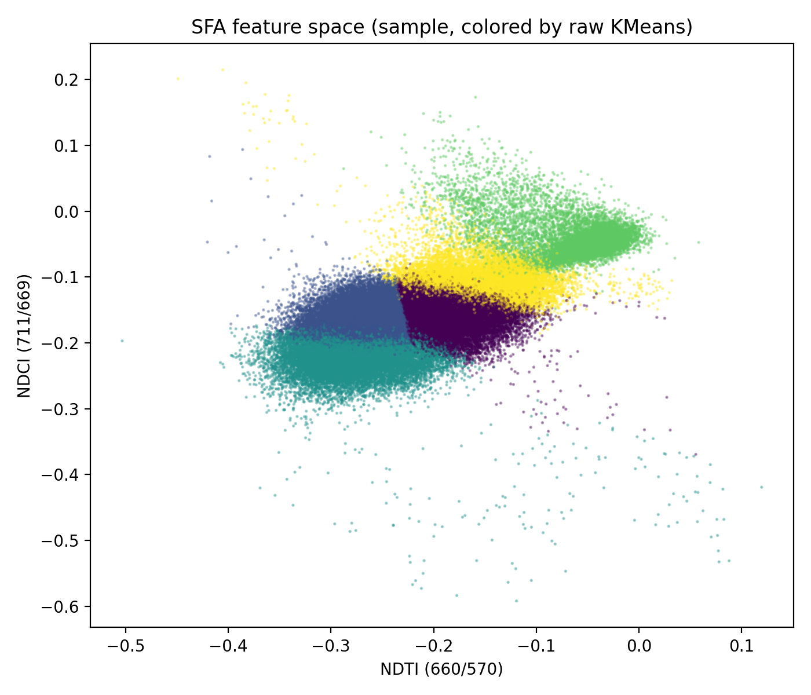
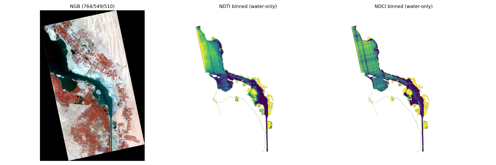
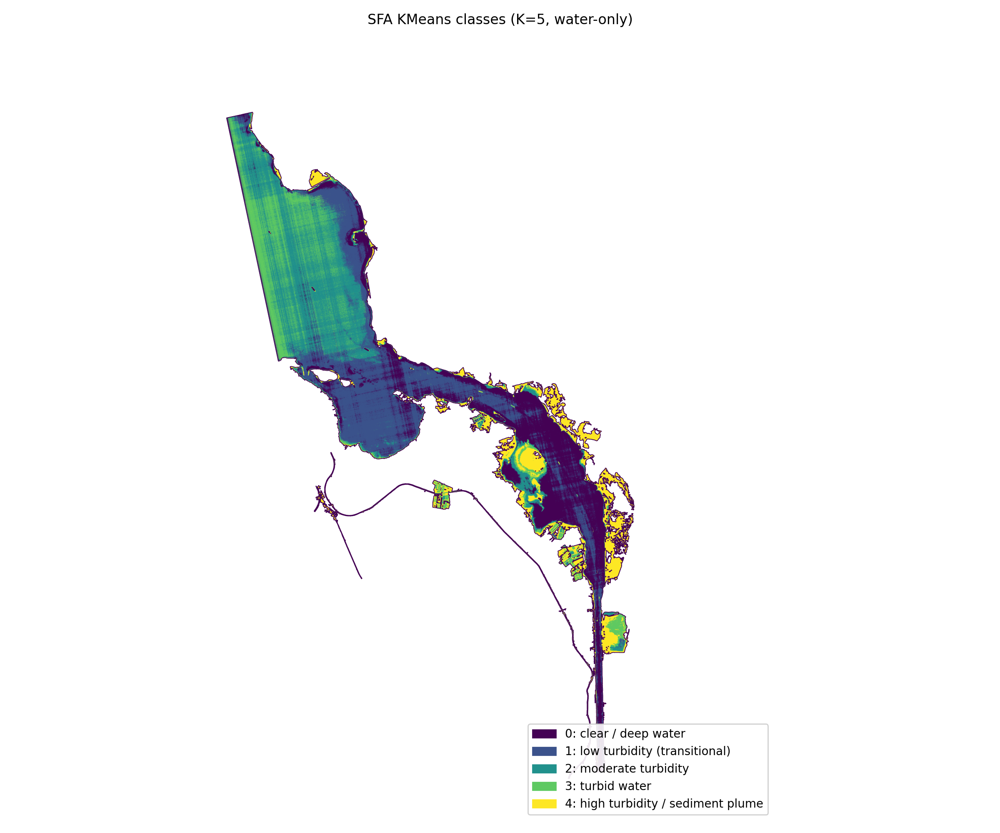
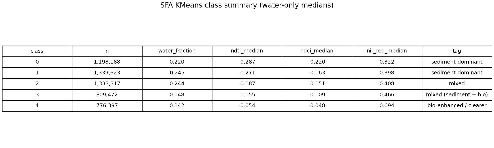
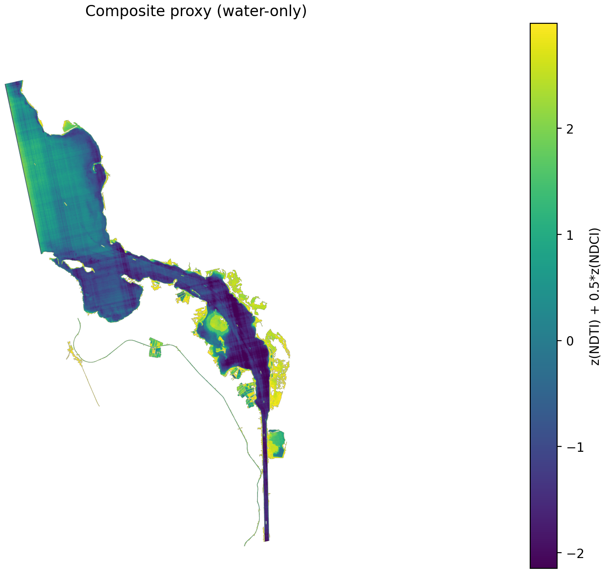
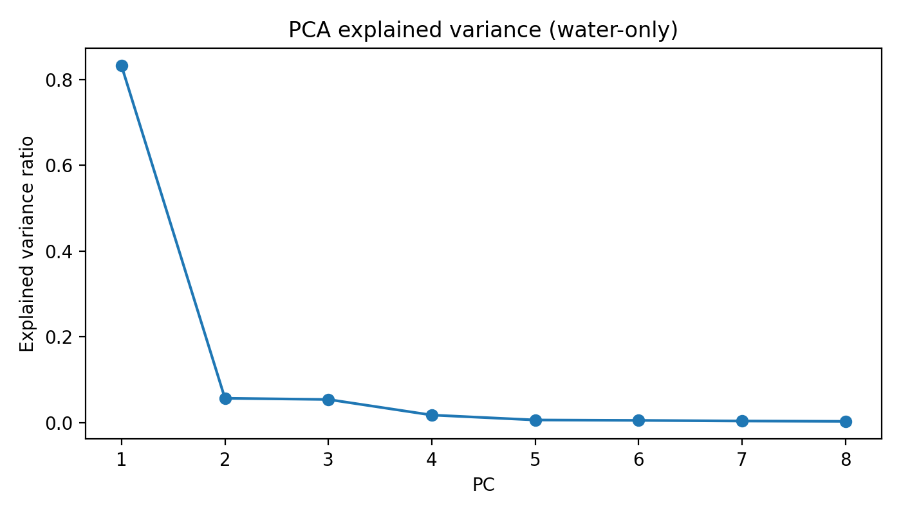
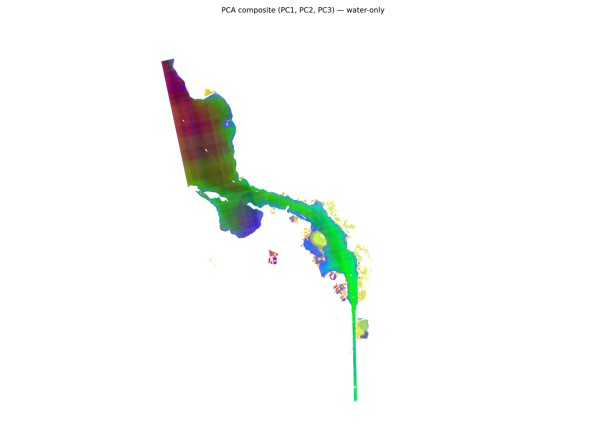
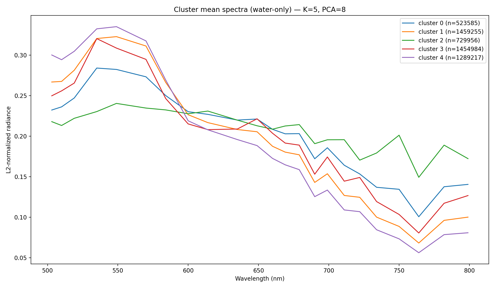

# Water Quality Analysis — Bitter Lake (Egypt)

Hyperspectral analysis of Bitter Lake using Wyvern Open Data.  
Focus: sediment turbidity, chlorophyll-related optical signals, and unsupervised optical water-type grouping.

---

## Key Highlights

- Physically motivated spectral feature analysis (NDTI, NDCI, NIR/Red)  
- Unsupervised water-type clustering (KMeans, K=5)  
- Continuous proxy mapping of turbidity and biological signal  
- Fully reproducible Python pipeline  

---

## Quicklook and Main Result

### Water-friendly composite (NGB)



The NGB composite enhances water structure and optical gradients. Darker regions indicate stronger absorption, while brighter zones often correspond to suspended sediment or shallow water.

---

### Unsupervised optical water types (SFA features + KMeans, K=5)


The unsupervised classification separates distinct optical water types. Clear and deeper water regions are spatially coherent, while sediment-dominated zones align with shoreline and inflow patterns.

---

## Data

**Sensor:** Wyvern Dragonette (L1B TOA radiance)  
**Location:** Bitter Lake, Egypt  

**Input products:**

- Hyperspectral radiance GeoTIFF  
- QA data mask (cloud masking only)

Notes:

- No atmospheric correction was applied.  
- All results should be interpreted as relative optical proxies, not absolute concentrations.  

---

## RGB Reference Visualization



RGB visualization provides visual context but offers limited discrimination of water optical properties compared to hyperspectral composites.

---

## Processing Pipeline

The analysis workflow follows four main steps:

1. QA masking and preprocessing  
2. Spectral feature extraction (SFA)  
3. Unsupervised clustering  
4. Proxy mapping and visualization  

---

## Spectral Feature Analysis (SFA)

This project uses physically interpretable spectral features:

- **NDTI (660 / 570):** turbidity / suspended sediment proxy  
- **NDCI (711 / 669):** red-edge / chlorophyll-related proxy  
- **NIR/Red (764 / 669):** red-edge strength proxy  

### Feature-space relationship (NDTI vs NDCI)



The scatter plot shows the joint distribution of turbidity and chlorophyll proxies across water pixels. Distinct density regions indicate multiple optical regimes that motivate unsupervised clustering.

### Feature maps (water-only)




NDTI highlights suspended sediment structure, while NDCI captures biologically influenced reflectance changes. The two proxies exhibit partially independent spatial patterns.

---

## Unsupervised Water-Type Grouping

Spectral feature vectors (NDTI, NDCI, NIR/Red) were clustered using KMeans (K=5) to extract dominant optical water types.

### Water-type classification map (water-only)



The map shows spatially coherent optical water classes after shoreline masking and background transparency. Major sediment-dominated and clear-water zones are clearly separated.

### Class summary statistics (water-only)




Class statistics confirm systematic separation between clear-water and high-turbidity clusters, with monotonic increases in turbidity proxies across ordered classes.

### Interpreted class meaning

Classes are ordered by median turbidity proxy (NDTI):

| Class | Interpretation |
|------:|----------------|
| 0 | Clear / deeper water |
| 1 | Low turbidity (transitional) |
| 2 | Moderate turbidity |
| 3 | Turbid water |
| 4 | High turbidity / sediment-dominated zones |

These labels describe relative optical properties, not ground-truth water quality categories.

---

## Composite Optical Proxy

A combined proxy highlights zones with elevated sediment and biological signal:

**Composite = z(NDTI) + 0.5 × z(NDCI)**



The composite proxy emphasizes areas where sediment and biological signals co-occur, highlighting transport corridors and accumulation regions.

---

## Hyperspectral PCA Diagnostics (Optional)

These diagnostics are based on the full hyperspectral cube and provide insight into spectral structure and clustering behavior.

### PCA explained variance (scree plot)



The first few principal components capture most spectral variance, indicating strong redundancy across hyperspectral bands.

---

### PCA composite (PC1, PC2, PC3)



PC1–PC3 visualization reveals dominant spectral gradients and spatial structure not visible in standard RGB imagery.

---

### Mean spectra per KMeans cluster



Mean spectra show systematic differences in spectral slope and magnitude across clusters, supporting interpretation as distinct optical water types.

---

## Discussion

The results demonstrate consistent spatial structure across spectral feature maps and unsupervised clustering.

Sediment-related proxies highlight shoreline and transport regions, while chlorophyll-sensitive indices reveal biologically active zones that are spatially distinct from sediment plumes. The clustering results reflect these gradients and separate clear water, transitional zones, and highly turbid regions.

PCA diagnostics indicate strong spectral redundancy, supporting dimensionality reduction for hyperspectral water analysis. Agreement between multiple independent indicators suggests that the extracted patterns represent physically meaningful optical variability rather than algorithm artifacts.

---

## Limitations

- TOA radiance used (no atmospheric correction)  
- No in-situ water quality measurements available  
- Indices represent optical proxies, not concentrations  
- Clustering is unsupervised and scene-dependent  

Results should be interpreted qualitatively.

---

## Running the Pipeline

From `projects/water_quality/`:

```bash
python scripts/03_quicklooks_rgb_fcc_water.py
python scripts/04_water_mask.py
python scripts/10_sfa_kmeans_water_classes.py
python scripts/11_proxy_maps_ndti_ndci.py
python scripts/12_class_proxy_summary.py
python scripts/14_make_proxy_panels.py

```
## Optional hyperspectral diagnostics:
```bash
python scripts/05_pca_kmeans_water.py
python scripts/06_kmeans_water_features.py
python scripts/08_overlay_water_classes_update.py
python scripts/13_composite_proxy_map.py
```

## Dependencies

- rasterio  
- numpy  
- scipy  
- scikit-learn  
- matplotlib  
- scikit-image  

---

## License

This project uses Wyvern Open Data and open-source Python scientific libraries.
