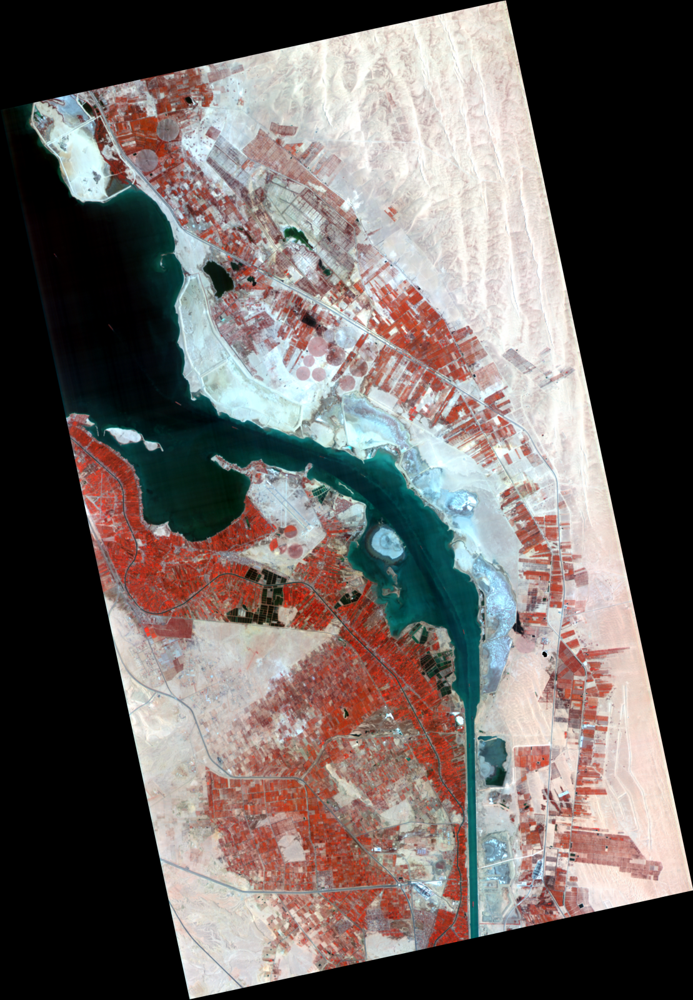
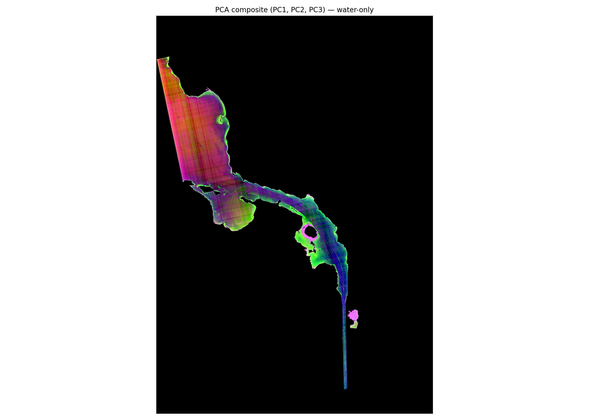
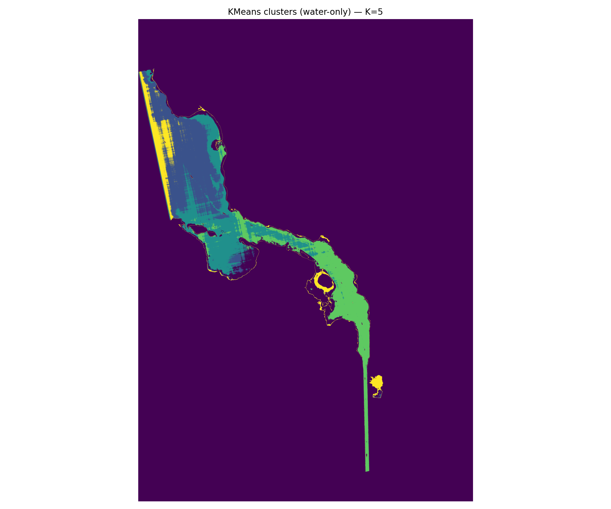
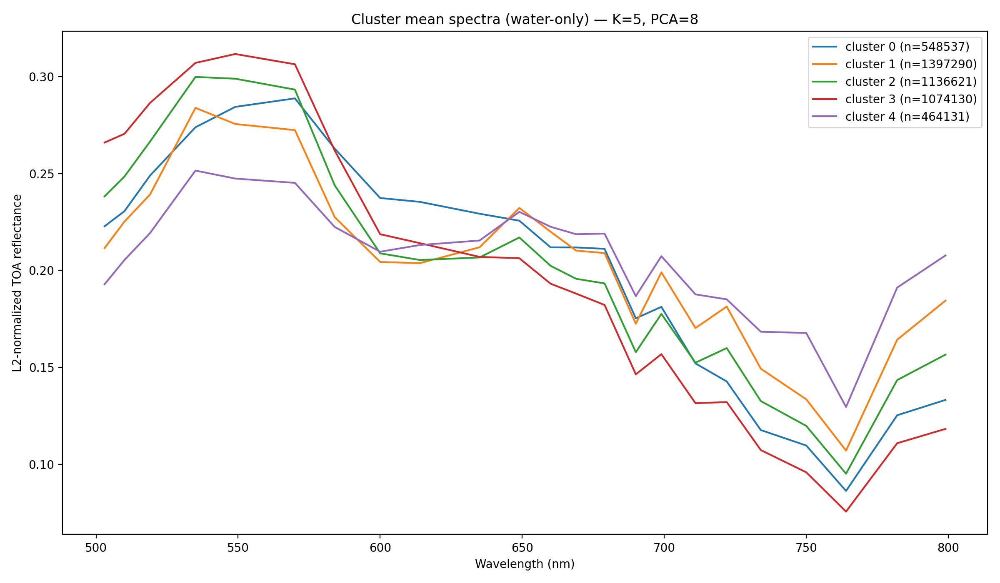
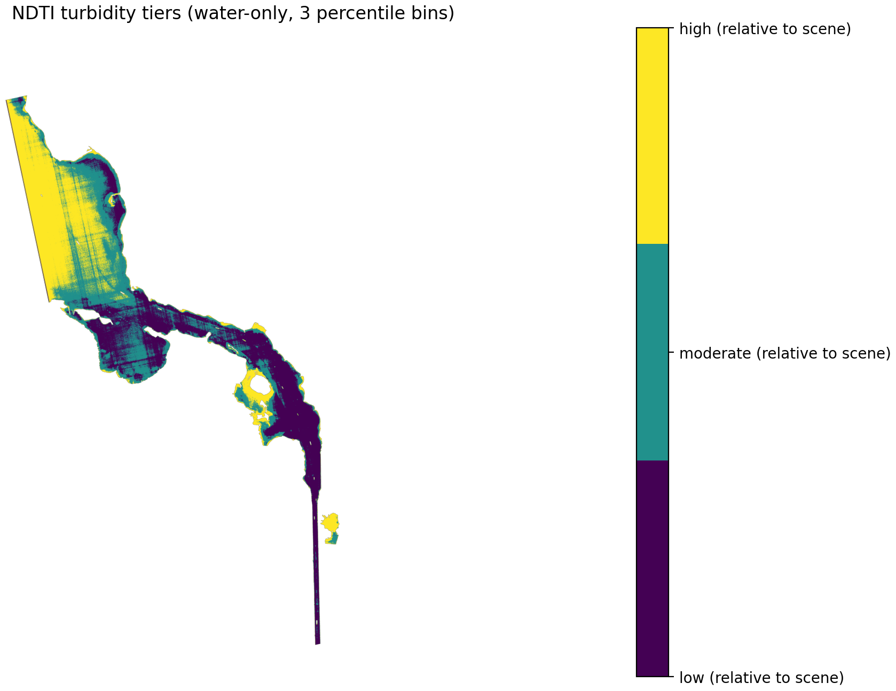
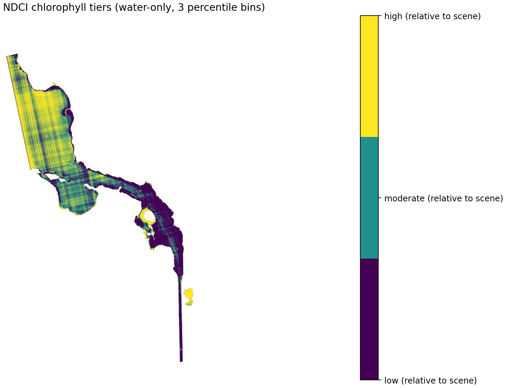
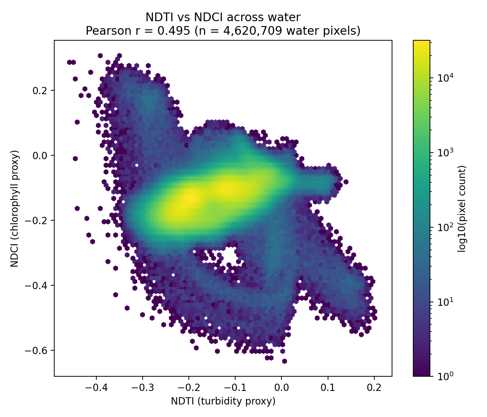
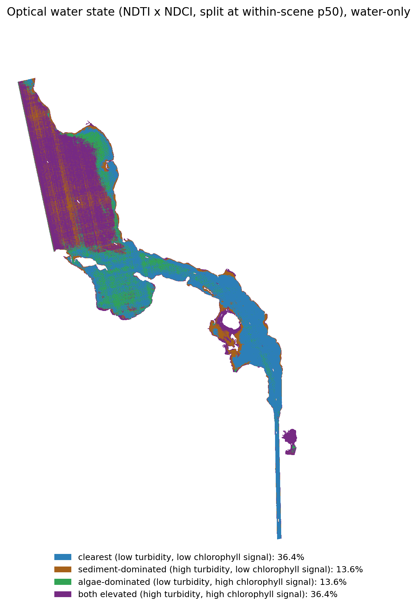

# Hyperspectral Water-Quality Proxies — Wyvern Dragonette

Water masking and optical water-quality **proxies** over a 31-band VNIR hyperspectral scene from the [Wyvern](https://wyvern.space/) Dragonette constellation, processed from L1B TOA radiance to **top-of-atmosphere (TOA) reflectance**.

**Study area:** Bitter Lake, Egypt. **Sensor:** Wyvern Dragonette, 31 VNIR bands (~510–900 nm). **Processing:** TOA reflectance, no atmospheric correction.

> **Proxies, not concentrations.** NDTI and NDCI track relative optical signals associated with turbidity and chlorophyll. They are **not** calibrated concentrations: there is no atmospheric correction (products are TOA, not surface reflectance) and no in-situ validation. Every map below is a relative optical proxy, meaningful only in relation to other water pixels in the same scene.

## What this project maps

The pipeline does two separate things over the lake, and it is worth keeping them apart. First, it groups water pixels by the overall shape of their reflectance spectra, an unsupervised view of how many optically distinct water types the scene contains. Second, it computes two published water indices, NDTI for turbidity and NDCI for chlorophyll, maps each one on its own, and then crosses them into a combined optical-state map. The first answers how many kinds of water are present; the second answers where each optical signal runs high or low, and where they coincide. Neither produces a calibrated water-quality number, and this project is careful not to imply one.

## The scene

**NGB composite (NIR-Green-Blue), QA-masked.** Clouds are removed (rendered black); the inland water body of Bitter Lake is the analysis target. The NIR-forward band choice darkens clear water and brightens vegetation and turbid water, making the shoreline and in-water structure legible.



## Method

```text
L1B TOA radiance
   │  convert  ── STAC solar illumination, sun elevation, Earth-Sun distance
   ▼
TOA reflectance ──► QA clear-mask
   │
   ├─► water mask       NDWI/NDVI thresholds + NIR-darkness, morphology,
   │                    keep the two largest connected water bodies
   ├─► water grouping   PCA(8) + KMeans(K=5) on water spectra,
   │                    unsupervised optical water types (cluster IDs arbitrary)
   └─► optical proxies  NDTI (turbidity) and NDCI (chlorophyll) as independent
                        tercile tier maps, an NDTI-NDCI scatter, a 2x2 optical-state
                        map crossing the two, and an illustrative equal-weight blend
```

Stated up front: the KMeans grouping is unsupervised, so its cluster IDs are arbitrary and carry no turbidity ranking. NDTI and NDCI are relative optical proxies on uncalibrated TOA reflectance, and the tier maps and optical states are within-scene orderings, not concentrations and not comparable across dates.

## Results (reference run)

### Spectral dimensionality

**PCA composite (PC1, PC2, PC3 → R, G, B), water-only.** Water-pixel reflectance is strongly low-dimensional: PC1 explains **74.2%**, two PCs **84.9%**, and eight PCs **95.9%** of variance. Colour gradients across the lake trace smooth optical variation from clear to turbid, not sharp boundaries.



### KMeans water grouping

**Full-spectrum PCA+KMeans (K=5), water-only.** This grouping is very stable, with a 6-seed mean ARI of **0.82** (sampled silhouette 0.33), notably more reproducible than the forest scene. The cluster IDs are arbitrary unsupervised labels, not a turbidity ranking. What the map shows is a coherent spatial gradient rather than a patchwork, consistent with the smooth PCA variation.



**Cluster mean spectra** (cluster colours match the class map above). Each curve is a cluster's mean reflectance with every pixel's spectrum first scaled to unit length, so the plot compares spectral shape rather than brightness. This is a numerical step, not a Level-2 surface-reflectance product: the data stays as uncalibrated TOA. The clusters separate mainly by how much reflectance survives into the near-infrared; overall brightness is a separate axis that does not follow the same ordering, which is why shape and brightness are kept as separate diagnostics.



### Optical proxy maps (NDTI, NDCI)

NDTI (turbidity) and NDCI (chlorophyll) are mapped independently, each binned into three relative tiers (terciles of that index's own water-pixel distribution) labelled low, moderate, and high relative to this scene. They are mapped separately on purpose: they track physically distinct signals, sediment load versus algal pigment, so collapsing them into one number would hide which signal drives a given location.

**NDTI turbidity tiers, water-only.** The turbidity proxy split into three within-scene terciles, each holding roughly a third of water pixels. Tier boundaries are percentiles of this scene's own NDTI distribution, so the labels are relative orderings, not absolute turbidity levels.



**NDCI chlorophyll tiers, water-only.** The chlorophyll proxy split the same way, into three within-scene terciles of the NDCI distribution. As with NDTI, low, moderate, and high are relative to this scene and carry no concentration units.



**How the two proxies relate.** Across 4.6 million water pixels the two indices have a Pearson correlation of **r = 0.50** (so r² ≈ 0.25: about a quarter of what they measure is shared, and roughly three quarters is independent). That is a moderate positive relationship, they tend to rise and fall together somewhat, but most of what each one measures is independent of the other. That is why they are mapped separately rather than merged into a single score, since each carries information the other does not. Read the correlation with some caution: on TOA reflectance over dark water, NDTI and NDCI both use red and red-edge bands and are both affected by the same atmosphere, so some of their apparent agreement is probably caused by the atmosphere itself (haze, sun glint, overall brightness) rather than by turbidity and chlorophyll genuinely occurring in the same places. Atmospheric correction would remove most of that shared atmospheric signal, and is the next step for this project.



### Optical state (NDTI × NDCI)

Crossing the two indices gives a combined view a single blended score cannot. Each water pixel is labelled by whether its turbidity proxy (NDTI) and chlorophyll proxy (NDCI) each sit above or below their own within-scene median, giving four optical states: clearest, sediment-dominated, algae-dominated, and both elevated. This names which signal is elevated where, and deliberately avoids the word "quality", since calling turbid or algae-rich water "worse" is a judgement the data does not contain.



Splitting each index at its median forces the state shares into a fixed symmetry: the two "one high, one low" states are always equal to each other, as are the two "both agree" states, so those percentages (here 36.4% clearest and both-elevated each, 13.6% for each mixed state) are an artefact of the median split, not a property of the lake. The informative number is how the two proxies line up in space: **72.8% of water falls into the two concordant states** (both proxies low, or both high), against the **50% expected if turbidity and chlorophyll were spatially independent**. That excess is the map-space echo of the r = 0.50 correlation above, where one proxy runs high the other tends to as well. As with that correlation, part of this agreement is likely the shared atmosphere rather than the two signals genuinely coinciding, so the concordance should firm up after atmospheric correction.

## Reproduce

```bash
pip install -e .
# place the scene per data/README.md, then:
python pipelines/run_pipeline.py --config configs/water_quality.yaml
```

Stages and thresholds (NDWI/NDVI cutoffs, band wavelengths, K, percentile bin count, the optical-state split, composite weights) live in `configs/water_quality.yaml`. The proxy tiers use three percentile bins, the optical states split each index at its within-scene median, and the illustrative blend uses equal NDTI/NDCI weights by design. Each run writes GeoTIFFs, proxy maps, CSVs, a `manifest.json`, and a `report.md` under `outputs/`.

## Limitations & next steps

Everything here is TOA and uncalibrated. NDTI and NDCI are optical proxies, not turbidity or chlorophyll concentrations, and the tier labels and optical states are within-scene relative orderings, not water-quality classes. The optical-state map names which proxy is elevated where; it deliberately avoids a single "quality" score, because ranking turbid or algae-rich water as "worse" is a judgement the data does not carry. The illustrative blend is a secondary, equal-weight z-score average of the two indices with no physical basis, kept only as an exploratory view; the honest combined product is the optical-state map, and the primary results are the two independent index maps.

Two steps would move these from relative proxies toward estimates, and this project deliberately takes neither.

The first is atmospheric correction to surface reflectance, which matters most for water because water is dark: the light leaving the water is only a small part of what the sensor sees at the top of the atmosphere, so the atmosphere dominates and is the likely reason the two proxies agree as much as they do. A surface-reflectance version of this scene would supply that correction, but it was not available here, and producing one to a defensible standard relies on proprietary, expensive processing tools (such as ENVI) that this project does not have access to. The L1B metadata that is available (solar elevation and per-band solar illumination, with no viewing geometry or aerosol information) is not enough for a sound correction in-house, and the one crude option the data does support, an image-based dark-pixel subtraction, was rejected because over dark water it over-corrects the visible bands and would look more calibrated than it is. The indices are kept as relative TOA proxies by choice, not oversight.

The second is a multi-date series over Bitter Lake, which would let the indices track change over time, a defensible use of relative proxies once the radiometry is consistent enough to compare one date against another. Wyvern does have L1B time-series data for this area and largely why this area was chosen in the first place, so it is only the next step in the improvement of this project. Full validation would additionally need in-situ water samples, which were not available for this scene.

## Outputs

```
outputs/masks/        water_mask.tif/.png, rgb_water_only.png
outputs/previews/     rgb_quicklook.png, ngb_water_composite.png
outputs/
  water_kmeans_K5_PCA8.{tif,png}                       full-spectrum PCA+KMeans
  water_kmeans_K5_PCA8_pca_pc123.png                   PCA composite
  water_kmeans_K5_PCA8_cluster_mean_spectra.{png,csv}  cluster spectra (figure + table)
  water_kmeans_K5_PCA8_cluster_stats.csv               per-cluster brightness + slope medians
  water_kmeans_K5_PCA8_summary.txt                     PCA variance, silhouette, ARI
outputs/water_features/proxies/
  ndti_continuous.png / ndci_continuous.png            continuous water-only proxy heatmaps
  ndti_tiers.png / ndci_tiers.png                      three-tier (tercile) proxy maps
  ndti_ndci_scatter.png                                NDTI vs NDCI density scatter (+ correlation)
  optical_state_2x2.png                                NDTI x NDCI 2x2 optical-state map
  optical_proxy_composite_continuous.png               illustrative equal-weight blend
outputs/  manifest.json / report.md
```

## Data sources & attribution

**Imagery — Wyvern Dragonette** open hyperspectral data, licensed under [CC BY 4.0](https://creativecommons.org/licenses/by/4.0/):

> © 2025 Wyvern Incorporated. All Rights Reserved.

No external validation reference is used for this project (no in-situ water-quality measurements or independent map were available for Bitter Lake); the water-quality indices are uncalibrated optical proxies, as noted above.