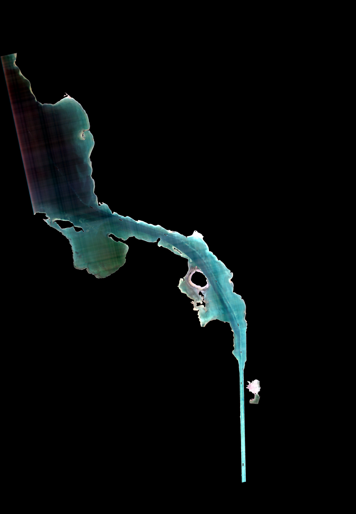

# Hyperspectral Water-Quality Proxies — Wyvern Dragonette

Water masking and optical water-quality **proxies** over a 31-band VNIR hyperspectral scene from the [Wyvern](https://wyvern.space/) Dragonette constellation, processed from L1B TOA radiance to **top-of-atmosphere (TOA) reflectance**.

**Study area:** Bitter Lake, Egypt. **Sensor:** Wyvern Dragonette, 31 VNIR bands (~510–900 nm). **Processing:** TOA reflectance, no atmospheric correction.

> **Proxies, not concentrations.** NDTI and NDCI track relative optical signals associated with turbidity and chlorophyll. They are **not** calibrated concentrations: there is no atmospheric correction (products are TOA, not surface reflectance) and no in-situ validation. Every map below is a relative optical proxy.

## Method

```text
L1B TOA radiance
   │  convert  ── STAC solar illumination, sun elevation, Earth–Sun distance
   ▼
TOA reflectance ──► QA clear-mask
   │
   ├─► water mask        NDWI/NDVI thresholds + NIR-darkness, morphology,
   │                     keep the two largest connected water bodies
   ├─► water grouping    PCA + KMeans on water spectra; KMeans on engineered
   │                     features (NDTI, NDCI, R/G, RE/R); SFA water types
   └─► optical proxies   NDTI (turbidity), NDCI (chlorophyll), composite z-blend
```

The water-type maps are **unsupervised groupings** of in-water spectra, relabeled by median NDTI (0 = clearest, 4 = most turbid). They group optically similar water; they are not validated classifications.

## Results (reference run)

Water-pixel PCA is strongly low-dimensional — **PC1 explains ~74%, two PCs ~85%, eight PCs ~96%** of variance. The full-spectrum K=5 PCA+KMeans grouping is **very stable**: 6-seed mean ARI of **0.82** (sampled silhouette 0.33), notably more reproducible than the forest scene.

The SFA grouping (KMeans on NDTI / NDCI / NIR-Red, relabeled by turbidity) splits the water into five tiers spanning roughly NDTI −0.21 (clearest) to −0.07 (most turbid):

| Tier | Class | Median NDTI | Median NDCI | Water fraction |
|---|---|---|---|---|
| clearest | 0 | −0.209 | −0.153 | 23.6% |
| low turbidity | 1 | −0.203 | −0.196 | 17.0% |
| moderate | 2 | −0.178 | −0.110 | 20.3% |
| turbid | 3 | −0.100 | −0.113 | 27.1% |
| most turbid | 4 | −0.065 | −0.069 | 12.0% |

The independent 4-feature KMeans (`water_features_kmeans`) recovers the same monotonic turbidity ordering across its five clusters (median NDTI −0.215 → −0.056), a useful internal consistency check between two different feature sets.




## Reproduce

```bash
pip install -e .
# place the scene per data/README.md, then:
python pipelines/run_pipeline.py --config configs/water_quality.yaml
```

Stages and thresholds (NDWI/NDVI cutoffs, band wavelengths, K, composite weights, percentiles) live in `configs/water_quality.yaml`. Each run writes GeoTIFFs, proxy maps, CSVs, a `manifest.json`, and a `report.md` under `outputs/`.

## Outputs

```
outputs/masks/
  water_mask.tif / .png                    water-only mask + preview
  rgb_water_only.png                       true-colour, water pixels only
outputs/previews/
  rgb_quicklook.png / ngb_water_composite.png
outputs/
  water_kmeans_K5_PCA8.{tif,png}           full-spectrum PCA+KMeans water grouping
  water_kmeans_K5_PCA8_summary.txt         PCA variance, silhouette, ARI
outputs/water_features/
  water_features_kmeans_K5.{tif,png}       4-feature KMeans (turbidity-ordered)
  water_features_kmeans_K5_cluster_feature_stats.csv
  ndti_map.png / ndci_map.png
  sfa_kmeans/sfa_kmeans_K5.{tif,png}       SFA water types
  sfa_kmeans/sfa_kmeans_K5_feature_stats.csv
  sfa_kmeans/sfa_kmeans_K5_class_summary.{csv,png}
  sfa_kmeans/sfa_kmeans_K5_ndci_ranking.txt
  proxies/{whole_scene,water_only}/ndti_*.png, ndci_*.png
  proxies/optical_proxy_composite_*.png    weighted NDTI+NDCI z-blend
  figures/panel_ngb_*.png                  multi-panel proxy figures
  rgb_with_water_classes.png / ngb_with_water_classes.png / water_classes_only.png
outputs/
  manifest.json / report.md                run provenance + auto report
```
